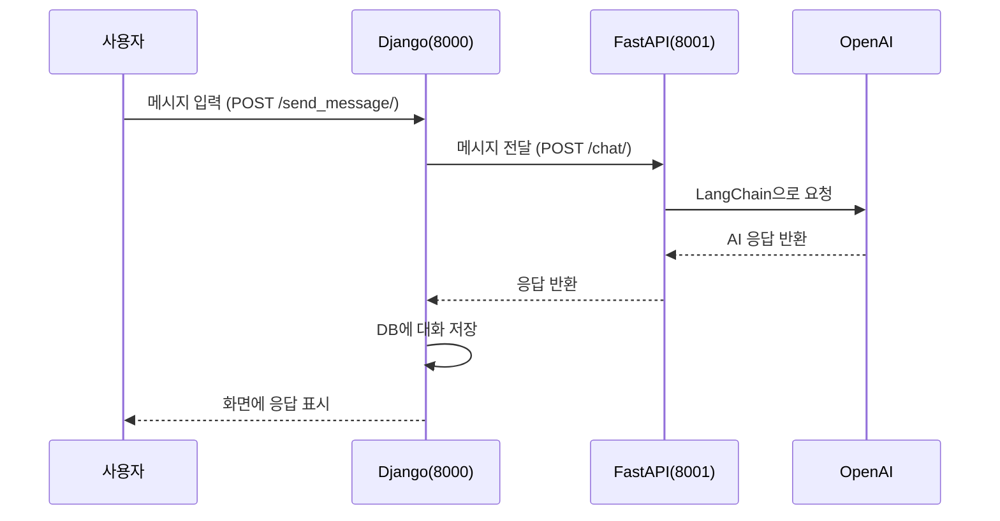

# Django + FastAPI + LangChain 챗봇 수업 가이드

## 학습 목표

이 실습을 마치면, **두 개의 독립적인 서버를 연결해 AI 챗봇 서비스를 구축**할 수 있습니다.
FastAPI로 LangChain + OpenAI를 연결한 AI 응답 서버를 만들고, Django로 채팅 UI와 대화 이력 저장 기능을 구현한 뒤,
두 서버가 HTTP API를 통해 통신하는 마이크로서비스 구조를 직접 경험합니다.

## 사전 준비

### 필요 도구

- Python 3.10 이상
- pip 패키지 매니저
- OpenAI API 키 (https://platform.openai.com 에서 발급)
- 코드 에디터 (VS Code 권장)
- 터미널 2개 (FastAPI용, Django용 각각 실행)

### 패키지 설치

```bash
# _12_django_fastapi_chatbot/ 루트 디렉토리에서 실행
pip install django fastapi "uvicorn[standard]" langchain langchain-openai langchain-community python-dotenv requests
```

### 사전 지식

- Django 기본 (models, views, templates, urls)
- FastAPI 기본 (라우터, Pydantic 모델)
- Python `async/await` 기초
- HTTP REST API 개념

---

## 전체 흐름 한눈에 보기

이 프로젝트는 **두 개의 서버**로 구성됩니다. FastAPI 서버(포트 8001)는 LangChain과 OpenAI를 연결해 AI 응답을 생성하는 "두뇌" 역할을 하고, Django 서버(포트 8000)는 사용자와 대화하는 채팅 화면을 제공하고 대화 이력을 DB에 저장하는 "얼굴" 역할을 합니다.

사용자가 메시지를 보내면, Django가 받아서 FastAPI로 전달하고, FastAPI는 LangChain을 통해 OpenAI에 요청한 뒤 응답을 Django로 돌려줍니다. Django는 이 대화를 SQLite DB에 기록합니다.

**구현 순서:**

1. **Phase 1** — FastAPI AI 서비스 구축 (AI 두뇌 만들기)
2. **Phase 2** — Django 웹 앱 구축 (채팅 UI + DB 연동)
3. **Phase 3** — 두 서버 연결 및 통합 테스트



---

## Phase 1: FastAPI AI 서비스 구축

### 목표

FastAPI 서버를 실행하고, `/docs`에서 채팅 API를 직접 호출해 OpenAI 응답을 받을 수 있다.

### 단계별 구현

#### Step 1.1 — 프로젝트 디렉토리 구조 확인하기

`fastapi_langchain/` 폴더 구조를 먼저 파악합니다:

```
fastapi_langchain/
├── .env.example          ← 환경 변수 예시 파일
├── main.py               ← FastAPI 앱 진입점
├── requirements.txt
├── models/
│   └── chat_models.py    ← Pydantic 요청/응답 모델
├── routers/
│   └── chat_router.py    ← API 라우터
└── services/
    └── langchain_service.py  ← LangChain + OpenAI 로직
```

> **💡 개념 설명: 관심사 분리 (Separation of Concerns)**
>
> 하나의 `main.py`에 모든 코드를 넣을 수도 있지만, 그렇게 하면 코드가 커질수록 찾기도, 고치기도 어려워집니다.
> 이 프로젝트는 역할별로 파일을 나눴습니다:
> - `models/`: "어떤 데이터를 주고받는가?"
> - `services/`: "실제 AI 로직은 무엇인가?"
> - `routers/`: "어떤 URL로 요청을 받는가?"
>
> **한 줄 요약**: 각 파일은 하나의 역할만 한다. 덕분에 서비스 로직만 교체해도 라우터는 바꿀 필요가 없다.

#### Step 1.2 — 환경 변수 파일 만들기

`.env.example`을 복사해 실제 API 키를 등록합니다:

```bash
# fastapi_langchain/ 디렉토리에서 실행
cp .env.example .env
```

`.env` 파일을 열고 API 키를 입력합니다:

```bash
# fastapi_langchain/.env

OPENAI_API_KEY=sk-proj-여기에_실제_키를_입력하세요

# 아래는 기본값이 있으므로 필요할 때만 수정
OPENAI_MODEL=gpt-4o-mini
OPENAI_TEMPERATURE=0.7
OPENAI_MAX_TOKENS=1000
```

> **⚠️ 주의**: `.env` 파일은 절대 Git에 커밋하면 안 됩니다. API 키가 노출되면 비용이 발생할 수 있습니다.

#### Step 1.3 — Pydantic 모델 정의하기

FastAPI는 Pydantic을 사용해 요청/응답 데이터의 형식을 미리 정의합니다.

> **💡 개념 설명: Pydantic 모델**
>
> API를 만들 때 가장 흔한 버그는 "클라이언트가 보낸 데이터 형식이 틀렸는데 서버가 그냥 받아버리는 것"입니다.
> Pydantic은 데이터가 들어오는 순간 자동으로 타입을 검증합니다. 형식이 틀리면 FastAPI가 자동으로 422 에러를 반환합니다.
>
> ```python
> class ChatRequest(BaseModel):
>     message: str  # 이 필드가 없으면 자동으로 에러!
> ```
>
> **한 줄 요약**: Pydantic 모델은 API의 "계약서" — 이 형식으로 보내야 받아준다.

```python
# fastapi_langchain/models/chat_models.py

from pydantic import BaseModel, Field
from typing import Optional
from datetime import datetime


class ChatRequest(BaseModel):
    """채팅 요청 모델"""
    message: str = Field(..., description="사용자 메시지", min_length=1, max_length=2000)
    session_id: Optional[str] = Field(default="default", description="세션 식별자")


class ChatResponse(BaseModel):
    """채팅 응답 모델"""
    response: str = Field(..., description="AI 응답 메시지")
    session_id: str = Field(..., description="세션 식별자")
    timestamp: datetime = Field(default_factory=datetime.now, description="응답 시간")


class ErrorResponse(BaseModel):
    """에러 응답 모델"""
    error: str = Field(..., description="에러 메시지")
    detail: Optional[str] = Field(None, description="상세 에러 정보")


class HistoryItem(BaseModel):
    """대화 이력 한 줄"""
    type: str = Field(..., description="메시지 타입: 'human' 또는 'ai'")
    content: str = Field(..., description="메시지 내용")


class SetHistoryRequest(BaseModel):
    """세션에 대화 이력을 주입하는 요청 모델"""
    session_id: Optional[str] = Field(default="default", description="세션 식별자")
    history: list[HistoryItem] = Field(default_factory=list, description="주입할 메시지 목록")
```

#### Step 1.4 — LangChain 서비스 구현하기

> **💡 개념 설명: LangChain과 RunnableWithMessageHistory**
>
> OpenAI API를 직접 호출하면 AI는 "기억"이 없습니다. 매 요청마다 새로운 대화처럼 처리합니다.
> LangChain의 `RunnableWithMessageHistory`는 세션별로 대화 기록을 자동 관리해 줍니다.
>
> 내부 동작:
> 1. 사용자 메시지 + 이전 대화 기록을 합쳐서 프롬프트를 구성
> 2. OpenAI에 전송
> 3. 응답을 받으면 대화 기록에 자동으로 추가
>
> ```
> 사용자: "내 이름은 철수야"  → AI: "반가워요, 철수님!"
> 사용자: "내 이름이 뭐야?"  → AI: "철수님이라고 하셨잖아요!"  ← 기억함!
> ```
>
> **한 줄 요약**: `RunnableWithMessageHistory` = 기억력을 가진 AI 체인.

```python
# fastapi_langchain/services/langchain_service.py

import os
from typing import Dict, List, Optional
from dotenv import load_dotenv
from langchain_openai import ChatOpenAI
from langchain_core.prompts import ChatPromptTemplate, MessagesPlaceholder
from langchain_core.runnables.history import RunnableWithMessageHistory
from langchain_community.chat_message_histories import ChatMessageHistory
from langchain_core.chat_history import BaseChatMessageHistory
import logging

load_dotenv()

logging.basicConfig(level=logging.INFO)
logger = logging.getLogger(__name__)


class LangChainChatService:
    """LangChain + OpenAI 기반 채팅 서비스"""

    def __init__(self):
        self.api_key = os.getenv("OPENAI_API_KEY")
        if not self.api_key:
            raise ValueError("OPENAI_API_KEY 환경 변수가 필요합니다")

        self.model_name = os.getenv("OPENAI_MODEL", "gpt-4o-mini")
        self.temperature = float(os.getenv("OPENAI_TEMPERATURE", "0.7"))
        self.max_tokens = int(os.getenv("OPENAI_MAX_TOKENS", "1000"))

        # OpenAI 모델 초기화
        self.llm = ChatOpenAI(
            openai_api_key=self.api_key,
            model=self.model_name,
            temperature=self.temperature,
            max_tokens=self.max_tokens
        )

        # 시스템 프롬프트 + 대화 이력 플레이스홀더 + 사용자 입력
        self.prompt = ChatPromptTemplate.from_messages([
            ("system",
             "You are a helpful AI assistant. "
             "You can communicate in Korean or English based on the user's preference. "
             "Be conversational and friendly."),
            MessagesPlaceholder(variable_name="history"),  # 대화 이력이 여기에 삽입됨
            ("human", "{input}")
        ])

        # 체인 구성: 프롬프트 → LLM
        self.chain = self.prompt | self.llm

        # 세션별 대화 이력 저장소 (메모리)
        self.session_stores: Dict[str, ChatMessageHistory] = {}

        # 대화 이력을 자동 관리하는 체인
        self.runnable_with_history = RunnableWithMessageHistory(
            self.chain,
            self.get_session_history,
            input_messages_key="input",
            history_messages_key="history",
        )

        logger.info(f"LangChain 서비스 초기화 완료: 모델={self.model_name}")

    def get_session_history(self, session_id: str) -> BaseChatMessageHistory:
        """세션 ID에 해당하는 대화 이력 반환 (없으면 새로 생성)"""
        if session_id not in self.session_stores:
            self.session_stores[session_id] = ChatMessageHistory()
            logger.info(f"새 세션 생성: {session_id}")
        return self.session_stores[session_id]

    async def get_chat_response(self, message: str, session_id: str = "default") -> str:
        """사용자 메시지를 받아 AI 응답 반환"""
        try:
            response = await self.runnable_with_history.ainvoke(
                {"input": message},
                config={"configurable": {"session_id": session_id}}
            )
            return response.content
        except Exception as e:
            logger.error(f"응답 생성 오류: {e}")
            raise Exception(f"AI 응답 생성 실패: {e}")

    def clear_session_memory(self, session_id: str) -> bool:
        """특정 세션의 대화 이력 삭제"""
        if session_id in self.session_stores:
            del self.session_stores[session_id]
            return True
        return False

    def get_chat_history_for_display(self, session_id: str) -> List[dict]:
        """세션의 대화 이력을 화면 표시용 형식으로 반환"""
        if session_id not in self.session_stores:
            return []
        history = []
        for msg in self.session_stores[session_id].messages:
            if msg.type == "human":
                history.append({"type": "user", "content": msg.content})
            elif msg.type == "ai":
                history.append({"type": "assistant", "content": msg.content})
        return history

    def get_active_sessions(self) -> List[str]:
        """활성 세션 목록 반환"""
        return list(self.session_stores.keys())

    def set_history(self, session_id: str, items: List[dict]) -> int:
        """DB에서 불러온 대화 이력을 세션에 주입 (페이지 새로고침 후 연속 대화 지원)"""
        self.session_stores[session_id] = ChatMessageHistory()
        loaded = 0
        for item in items:
            msg_type = (item.get("type") or "").lower()
            content = item.get("content") or ""
            if not content:
                continue
            if msg_type in ("human", "user"):
                self.session_stores[session_id].add_user_message(content)
                loaded += 1
            elif msg_type in ("ai", "assistant"):
                self.session_stores[session_id].add_ai_message(content)
                loaded += 1
        return loaded


# 전역 서비스 인스턴스 (앱 실행 시 1번만 생성)
chat_service = LangChainChatService()
```

#### Step 1.5 — API 라우터 작성하기

> **💡 개념 설명: FastAPI 라우터 (APIRouter)**
>
> 모든 URL을 `main.py` 하나에 몰아넣으면 파일이 너무 커집니다.
> `APIRouter`는 URL 그룹을 별도 파일로 분리하고, `main.py`에서 prefix를 붙여 등록합니다.
>
> ```python
> # routers/chat_router.py
> router = APIRouter()
>
> @router.post("/")          # 실제 URL: /chat/
> @router.get("/history/")   # 실제 URL: /chat/history/
> ```
>
> **한 줄 요약**: `APIRouter` = URL 모음 파일, `include_router`로 prefix를 붙여 main.py에 연결한다.

```python
# fastapi_langchain/routers/chat_router.py

from fastapi import APIRouter, HTTPException
from models.chat_models import ChatRequest, ChatResponse, SetHistoryRequest
from services.langchain_service import chat_service
import logging

logger = logging.getLogger(__name__)
router = APIRouter()


@router.post("/", response_model=ChatResponse)
async def send_message(chat_request: ChatRequest):
    """사용자 메시지를 받아 AI 응답 반환"""
    try:
        response = await chat_service.get_chat_response(
            message=chat_request.message,
            session_id=chat_request.session_id
        )
        return ChatResponse(response=response, session_id=chat_request.session_id)
    except Exception as e:
        raise HTTPException(status_code=500, detail=str(e))


@router.get("/history/{session_id}")
async def get_chat_history(session_id: str):
    """특정 세션의 대화 이력 조회"""
    history = chat_service.get_chat_history_for_display(session_id)
    return {"session_id": session_id, "history": history}


@router.delete("/session/{session_id}")
async def clear_session(session_id: str):
    """특정 세션의 대화 이력 삭제"""
    success = chat_service.clear_session_memory(session_id)
    if success:
        return {"message": f"세션 {session_id} 삭제 완료"}
    return {"message": f"세션 {session_id}를 찾을 수 없음"}


@router.get("/sessions")
async def list_active_sessions():
    """활성 세션 목록 조회"""
    sessions = chat_service.get_active_sessions()
    return {"active_sessions": sessions, "count": len(sessions)}


@router.get("/test")
async def test_endpoint():
    """라우터 동작 확인용 테스트 엔드포인트"""
    return {"message": "Chat router is working!", "service_status": "active"}


@router.post("/history/set")
async def set_history(request: SetHistoryRequest):
    """DB에서 불러온 이력을 FastAPI 세션에 주입"""
    session_id = request.session_id or "default"
    loaded = chat_service.set_history(
        session_id=session_id,
        items=[{"type": item.type, "content": item.content} for item in request.history]
    )
    return {"message": "이력 주입 완료", "session_id": session_id, "loaded": loaded}
```

#### Step 1.6 — FastAPI 앱 진입점 작성하기

> **💡 개념 설명: CORS (Cross-Origin Resource Sharing)**
>
> 브라우저는 보안상 다른 주소(포트 포함)로의 요청을 기본적으로 차단합니다.
> `localhost:8000` (Django)에서 `localhost:8001` (FastAPI)로 요청하면 브라우저가 막습니다.
>
> 서버 간 요청(Django 뷰에서 `requests.post()`)은 브라우저를 거치지 않으므로 CORS가 무관합니다.
> 하지만 미래에 프론트엔드 JS에서 직접 FastAPI를 호출할 경우를 대비해 CORS를 설정해 두는 것이 좋은 관행입니다.
>
> **한 줄 요약**: CORS는 브라우저가 다른 출처의 서버와 통신할 수 있도록 허용하는 설정이다.

```python
# fastapi_langchain/main.py

from fastapi import FastAPI
from fastapi.middleware.cors import CORSMiddleware
from routers import chat_router
import uvicorn

app = FastAPI(
    title="ChatBot LangChain API",
    description="FastAPI + LangChain + OpenAI 챗봇 서비스",
    version="1.0.0"
)

# CORS 설정 — Django 앱에서의 요청 허용
app.add_middleware(
    CORSMiddleware,
    allow_origins=["http://localhost:8000", "http://127.0.0.1:8000"],
    allow_credentials=True,
    allow_methods=["*"],
    allow_headers=["*"],
)

# 라우터 등록 — /chat/ 이하 모든 URL을 chat_router에서 처리
app.include_router(chat_router.router, prefix="/chat", tags=["chat"])


@app.get("/")
async def root():
    return {"message": "ChatBot LangChain API is running!", "docs": "/docs"}


@app.get("/health")
async def health_check():
    return {"status": "healthy"}


if __name__ == "__main__":
    uvicorn.run(app, host="0.0.0.0", port=8001)
```

### 체크포인트 1 — FastAPI 서버 동작 확인

터미널 1에서 FastAPI 서버를 실행합니다:

```bash
# fastapi_langchain/ 디렉토리에서 실행
cd fastapi_langchain
uvicorn main:app --reload --port 8001
```

브라우저에서 **http://localhost:8001/docs** 를 열어 확인합니다:

- `GET /` → `{"message": "ChatBot LangChain API is running!"}` 확인
- `GET /health` → `{"status": "healthy"}` 확인
- `POST /chat/` → Swagger UI에서 직접 테스트:
  ```json
  {
    "message": "안녕하세요! 당신은 누구인가요?",
    "session_id": "test-session-1"
  }
  ```
- AI가 응답을 반환하면 Phase 1 완료!

---

> ⏸ **여기서 첫 번째 세션을 마칩니다.** FastAPI 서버가 AI 응답을 정상 반환하는 것을 확인했습니다.

---

## Phase 2: Django 웹 앱 구축

### 목표

Django 서버를 실행하고, 브라우저에서 채팅 UI에 접속해 메시지를 입력할 수 있다. (아직 FastAPI 연동 전)

### 단계별 구현

#### Step 2.1 — Django 프로젝트 구조 이해하기

```
django_webapp/
├── manage.py
├── requirements.txt
├── django_webapp/           ← 프로젝트 설정 패키지
│   ├── settings.py
│   ├── urls.py
│   └── wsgi.py
├── chat/                    ← 채팅 앱
│   ├── models.py            ← DB 모델 (ChatMessage)
│   ├── views.py             ← 뷰 함수
│   ├── urls.py              ← URL 라우팅
│   └── migrations/
└── templates/
    └── chat/
        ├── base.html        ← 공통 HTML/CSS
        └── chat.html        ← 채팅 UI + JavaScript
```

> **💡 개념 설명: Django 앱 분리**
>
> Django 프로젝트(`django_webapp`)는 전체 설정을 담당하고, 앱(`chat`)은 실제 기능을 담당합니다.
> 하나의 프로젝트에 여러 앱(`chat`, `accounts`, `blog` 등)을 붙일 수 있습니다.
>
> **한 줄 요약**: 프로젝트는 설정, 앱은 기능. `INSTALLED_APPS`에 앱을 등록해야 Django가 인식한다.

#### Step 2.2 — Django 설정 파일 작성하기

```python
# django_webapp/django_webapp/settings.py (일부 발췌)

INSTALLED_APPS = [
    'django.contrib.admin',
    'django.contrib.auth',
    'django.contrib.contenttypes',
    'django.contrib.sessions',
    'django.contrib.messages',
    'django.contrib.staticfiles',
    'chat',   # ← 우리가 만든 채팅 앱 등록
]

# 템플릿 디렉토리 설정
TEMPLATES = [
    {
        'BACKEND': 'django.template.backends.django.DjangoTemplates',
        'DIRS': [BASE_DIR / 'templates'],   # ← templates/ 폴더를 루트로 설정
        'APP_DIRS': True,
        ...
    },
]

# 데이터베이스: 개발 환경에서 SQLite 사용
DATABASES = {
    'default': {
        'ENGINE': 'django.db.backends.sqlite3',
        'NAME': BASE_DIR / 'db.sqlite3',
    }
}

# FastAPI 서비스 주소 — views.py에서 사용
FASTAPI_SERVICE_URL = 'http://localhost:8001'
```

#### Step 2.3 — ChatMessage 모델 정의하기

> **💡 개념 설명: Django ORM 모델**
>
> Django는 Python 클래스를 DB 테이블로 자동 변환합니다. 직접 SQL을 쓸 필요가 없습니다.
>
> ```python
> class ChatMessage(models.Model):
>     content = models.TextField()
> ```
>
> 위 코드 한 줄이 `CREATE TABLE chat_chatmessage (content TEXT)` SQL을 생성합니다.
> 테이블 생성은 `makemigrations` → `migrate` 명령으로 실행합니다.
>
> **한 줄 요약**: Django 모델은 Python 클래스 = DB 테이블. ORM이 SQL을 대신 써준다.

```python
# django_webapp/chat/models.py

from django.db import models
from django.utils import timezone


class ChatMessage(models.Model):
    """대화 메시지를 저장하는 모델 (human/ai 각각 별도 row)"""
    MESSAGE_TYPE_CHOICES = [
        ('human', 'Human'),
        ('ai', 'AI')
    ]

    session_id = models.CharField(max_length=255, db_index=True)   # 세션 식별자
    message_type = models.CharField(max_length=10, choices=MESSAGE_TYPE_CHOICES)  # 'human' or 'ai'
    content = models.TextField()                                     # 메시지 내용
    created_at = models.DateTimeField(default=timezone.now)         # 생성 시각

    class Meta:
        ordering = ['created_at']   # 시간 오름차순 정렬

    def __str__(self):
        return f"{self.session_id} - {self.message_type}: {self.content[:50]}"
```

#### Step 2.4 — 마이그레이션 실행하기

모델을 정의한 후 반드시 DB에 테이블을 생성해야 합니다:

```bash
# django_webapp/ 디렉토리에서 실행
cd django_webapp
python manage.py makemigrations chat   # 변경사항을 마이그레이션 파일로 생성
python manage.py migrate               # 마이그레이션을 DB에 적용
```

#### Step 2.5 — 뷰(Views) 작성하기

> **💡 개념 설명: Django 뷰에서 외부 API 호출**
>
> Django 뷰는 기본적으로 동기(synchronous)로 동작합니다.
> FastAPI 서버로 HTTP 요청을 보낼 때 `requests` 라이브러리를 사용합니다.
>
> 흐름:
> 1. 사용자 → Django (`POST /send_message/`)
> 2. Django → FastAPI (`POST http://localhost:8001/chat/`)  ← `requests.post()`
> 3. FastAPI → OpenAI
> 4. 응답이 거슬러 올라와 Django DB에 저장
>
> **한 줄 요약**: Django가 FastAPI의 클라이언트 역할. `requests.post()`로 서버 간 통신한다.

```python
# django_webapp/chat/views.py

import json
import requests
from django.shortcuts import render
from django.http import JsonResponse
from django.views.decorators.csrf import csrf_exempt
from django.conf import settings
from .models import ChatMessage


def chat_view(request):
    """채팅 화면 렌더링 — GET 파라미터로 session_id를 받아 이전 대화를 이어갈 수 있음"""
    session_id = request.GET.get('session_id')
    context = {'session_id': session_id} if session_id else {}
    return render(request, 'chat/chat.html', context)


@csrf_exempt
def send_message(request):
    """사용자 메시지를 FastAPI로 전달하고, 응답을 DB에 저장"""
    if request.method != 'POST':
        return JsonResponse({'error': 'POST 요청만 허용됩니다'}, status=405)

    try:
        data = json.loads(request.body)
        user_message = data.get('message', '')
        session_id = data.get('session_id', 'default')

        if not user_message:
            return JsonResponse({'error': '메시지를 입력해주세요'}, status=400)

        # FastAPI 서비스로 메시지 전달
        fastapi_url = f"{settings.FASTAPI_SERVICE_URL}/chat/"
        response = requests.post(
            fastapi_url,
            json={'message': user_message, 'session_id': session_id},
            timeout=30
        )

        if response.status_code == 200:
            bot_response = response.json().get('response', '')

            # 사용자 메시지와 AI 응답을 DB에 저장
            ChatMessage.objects.create(session_id=session_id, message_type='human', content=user_message)
            ChatMessage.objects.create(session_id=session_id, message_type='ai', content=bot_response)

            return JsonResponse({'response': bot_response, 'status': 'success'})
        else:
            return JsonResponse({'error': 'FastAPI 서비스 오류', 'status': 'error'}, status=500)

    except requests.exceptions.RequestException as e:
        return JsonResponse({'error': f'연결 오류: {e}', 'status': 'error'}, status=500)
    except json.JSONDecodeError:
        return JsonResponse({'error': '잘못된 JSON 형식'}, status=400)


def get_history(request):
    """DB에서 대화 이력을 불러오고, FastAPI 세션에도 주입해 연속 대화를 지원"""
    session_id = request.GET.get('session_id', 'default')
    messages = ChatMessage.objects.filter(session_id=session_id)[:20]

    history = []
    service_history = []
    for msg in messages:
        history.append({
            'type': 'user' if msg.message_type == 'human' else 'bot',
            'message': msg.content,
            'timestamp': msg.created_at.isoformat()
        })
        service_history.append({
            'type': msg.message_type,
            'content': msg.content
        })

    # FastAPI 세션에 DB 이력 주입 (실패해도 화면 이력 반환은 계속)
    try:
        requests.post(
            f"{settings.FASTAPI_SERVICE_URL}/chat/history/set",
            json={'session_id': session_id, 'history': service_history},
            timeout=15
        )
    except requests.exceptions.RequestException:
        pass

    return JsonResponse({'history': history})
```

#### Step 2.6 — URL 라우팅 설정하기

```python
# django_webapp/chat/urls.py

from django.urls import path
from . import views

app_name = 'chat'

urlpatterns = [
    path('', views.chat_view, name='chat'),                    # GET / → 채팅 화면
    path('send_message/', views.send_message, name='send_message'),   # POST /send_message/
    path('get_history/', views.get_history, name='get_history'),      # GET /get_history/
]
```

```python
# django_webapp/django_webapp/urls.py

from django.contrib import admin
from django.urls import path, include

urlpatterns = [
    path('admin/', admin.site.urls),
    path('', include('chat.urls')),   # 루트 URL을 chat 앱에 위임
]
```

#### Step 2.7 — 베이스 템플릿 작성하기 (HTML/CSS)

```html
<!-- django_webapp/templates/chat/base.html -->

<!DOCTYPE html>
<html lang="ko">
  <head>
    <meta charset="UTF-8" />
    <meta name="viewport" content="width=device-width, initial-scale=1.0" />
    <title>AI 챗봇</title>
    <style>
      * { margin: 0; padding: 0; box-sizing: border-box; }

      body {
        font-family: "Segoe UI", sans-serif;
        background: linear-gradient(135deg, #667eea 0%, #764ba2 100%);
        min-height: 100vh;
        display: flex;
        justify-content: center;
        align-items: center;
      }

      .chat-container {
        background: white;
        border-radius: 20px;
        box-shadow: 0 20px 40px rgba(0,0,0,0.1);
        width: 90%;
        max-width: 800px;
        height: 80vh;
        display: flex;
        flex-direction: column;
        overflow: hidden;
      }

      .chat-header {
        background: linear-gradient(135deg, #667eea 0%, #764ba2 100%);
        color: white;
        padding: 20px;
        text-align: center;
      }

      .chat-messages {
        flex: 1;
        padding: 20px;
        overflow-y: auto;
        background: #f8f9fa;
      }

      .message { margin: 10px 0; display: flex; }
      .message.user { justify-content: flex-end; }

      .message-content {
        max-width: 70%;
        padding: 12px 18px;
        border-radius: 18px;
        word-wrap: break-word;
        box-shadow: 0 2px 8px rgba(0,0,0,0.1);
      }

      .message.user .message-content {
        background: linear-gradient(135deg, #667eea 0%, #764ba2 100%);
        color: white;
      }

      .message.bot .message-content {
        background: white;
        color: #333;
        border: 1px solid #e9ecef;
      }

      .chat-input-container {
        padding: 20px;
        background: white;
        border-top: 1px solid #e9ecef;
      }

      .chat-input-form { display: flex; gap: 10px; }

      .chat-input {
        flex: 1;
        padding: 12px 18px;
        border: 2px solid #e9ecef;
        border-radius: 25px;
        outline: none;
        font-size: 16px;
        transition: border-color 0.3s;
      }

      .chat-input:focus { border-color: #667eea; }

      .send-button {
        padding: 12px 24px;
        background: linear-gradient(135deg, #667eea 0%, #764ba2 100%);
        color: white;
        border: none;
        border-radius: 25px;
        cursor: pointer;
        font-size: 16px;
        font-weight: 600;
        transition: transform 0.2s;
      }

      .send-button:hover { transform: translateY(-2px); }
      .send-button:disabled { opacity: 0.6; cursor: not-allowed; transform: none; }

      .typing-indicator { display: none; padding: 10px; }

      .typing-indicator .dot {
        display: inline-block;
        width: 8px; height: 8px;
        border-radius: 50%;
        background: #999;
        margin: 0 2px;
        animation: typing 1.4s infinite;
      }

      .typing-indicator .dot:nth-child(2) { animation-delay: 0.2s; }
      .typing-indicator .dot:nth-child(3) { animation-delay: 0.4s; }

      @keyframes typing {
        0%, 60%, 100% { transform: translateY(0); }
        30% { transform: translateY(-10px); }
      }

      .error-message {
        background: #ff6b6b;
        color: white;
        padding: 10px;
        border-radius: 10px;
        margin: 10px 0;
        text-align: center;
      }
    </style>
  </head>
  <body>
    
    
  </body>
</html>
```

#### Step 2.8 — 채팅 UI 템플릿 작성하기 (JavaScript 포함)

> **💡 개념 설명: Django 템플릿과 JavaScript의 경계**
>
> Django 템플릿 태그(`{{ }}`, ``)는 **서버**에서 처리됩니다. 즉, HTML이 브라우저로 전송되기 전에 실행됩니다.
> JavaScript는 **브라우저**에서 실행됩니다. 따라서 Django 변수를 JS로 넘기려면 템플릿 렌더링 시점에 JS 코드에 값을 삽입해야 합니다.
>
> ```javascript
> // 이 코드는 서버에서 렌더링될 때 session_id 값이 채워짐
> body: JSON.stringify({
>     session_id: '{{ session_id }}' || sessionId  // Django → JS
> })
> ```
>
> **한 줄 요약**: `{{ }}` 는 서버 렌더링, JS 코드는 브라우저 실행. 서버 값을 JS에 전달할 때는 템플릿 변수를 직접 삽입한다.

```html
<!-- django_webapp/templates/chat/chat.html -->



AI 챗봇 - 대화하기


<div class="chat-container">
    <div class="chat-header">
        <h1>🤖 AI 챗봇</h1>
        <p>안녕하세요! 무엇을 도와드릴까요?</p>
    </div>

    <div class="chat-messages" id="chat-messages">
        <div class="message bot">
            <div class="message-content">
                안녕하세요! AI 챗봇입니다. 궁금한 것이 있으면 언제든지 물어보세요! 😊
            </div>
        </div>
    </div>

    <div class="typing-indicator" id="typing-indicator">
        <div class="message bot">
            <div class="message-content">
                <span class="dot"></span>
                <span class="dot"></span>
                <span class="dot"></span>
            </div>
        </div>
    </div>

    <div class="chat-input-container">
        <form class="chat-input-form" id="chat-form">
            <input type="text" class="chat-input" id="message-input"
                   placeholder="메시지를 입력하세요..." autocomplete="off" />
            <button type="submit" class="send-button" id="send-button">전송</button>
        </form>
    </div>
</div>



<script>
// 세션 ID: URL 파라미터로 전달된 경우 사용, 없으면 랜덤 생성
const sessionId = '{{ session_id }}' || Math.random().toString(36).substring(2, 15);

const chatMessages = document.getElementById('chat-messages');
const messageInput = document.getElementById('message-input');
const sendButton = document.getElementById('send-button');
const chatForm = document.getElementById('chat-form');
const typingIndicator = document.getElementById('typing-indicator');

function scrollToBottom() {
    chatMessages.scrollTop = chatMessages.scrollHeight;
}

function addMessage(content, isUser = false) {
    const messageDiv = document.createElement('div');
    messageDiv.className = `message ${isUser ? 'user' : 'bot'}`;
    const messageContent = document.createElement('div');
    messageContent.className = 'message-content';
    messageContent.textContent = content;
    messageDiv.appendChild(messageContent);
    chatMessages.appendChild(messageDiv);
    scrollToBottom();
}

function setLoading(isLoading) {
    typingIndicator.style.display = isLoading ? 'block' : 'none';
    sendButton.disabled = isLoading;
    sendButton.textContent = isLoading ? '전송 중...' : '전송';
    scrollToBottom();
}

function showError(message) {
    const errorDiv = document.createElement('div');
    errorDiv.className = 'error-message';
    errorDiv.textContent = `오류: ${message}`;
    chatMessages.appendChild(errorDiv);
    scrollToBottom();
}

async function sendMessage(message) {
    if (!message.trim()) return;

    addMessage(message, true);
    setLoading(true);

    try {
        // Django send_message/ 엔드포인트로 전송
        const response = await fetch('/send_message/', {
            method: 'POST',
            headers: {'Content-Type': 'application/json'},
            body: JSON.stringify({message: message, session_id: sessionId})
        });

        const data = await response.json();

        if (data.status === 'success') {
            addMessage(data.response, false);
        } else {
            showError(data.error || '알 수 없는 오류가 발생했습니다.');
        }
    } catch (error) {
        showError('네트워크 오류가 발생했습니다. 잠시 후 다시 시도해주세요.');
    } finally {
        setLoading(false);
    }
}

// 폼 제출 이벤트
chatForm.addEventListener('submit', async (e) => {
    e.preventDefault();
    const message = messageInput.value.trim();
    if (message) {
        messageInput.value = '';
        await sendMessage(message);
    }
});

// Enter 키 지원
messageInput.addEventListener('keypress', (e) => {
    if (e.key === 'Enter' && !e.shiftKey) {
        e.preventDefault();
        chatForm.dispatchEvent(new Event('submit'));
    }
});

// 페이지 로드 시 이전 대화 이력 복원
window.addEventListener('load', async () => {
    
    try {
        const response = await fetch(`/get_history/?session_id={{ session_id }}`);
        const data = await response.json();

        if (data.history && data.history.length > 0) {
            chatMessages.innerHTML = '';  // 환영 메시지 제거
            data.history.forEach(msg => {
                addMessage(msg.message, msg.type === 'user');
            });
        }
    } catch (error) {
        console.error('대화 이력 로드 실패:', error);
    }
    

    messageInput.focus();
});
</script>

```

### 체크포인트 2 — Django 서버 동작 확인

터미널 2에서 Django 서버를 실행합니다:

```bash
# django_webapp/ 디렉토리에서 실행
cd django_webapp
python manage.py runserver 8000
```

브라우저에서 **http://localhost:8000** 을 열어 확인합니다:

- 채팅 UI가 정상적으로 렌더링되는가?
- 메시지를 입력하면 오른쪽(사용자)에 말풍선이 나타나는가?
- AI 응답도 잘 나타나는가?
- (FastAPI 서버도 켜져 있어야 합니다!)

---

## Phase 3: 통합 테스트 및 고급 기능 확인

### 목표

두 서버가 연결되어 정상 동작하는지 확인하고, 대화 이력 복원 기능까지 검증한다.

### 단계별 구현

#### Step 3.1 — 두 서버 동시 실행하기

**터미널 1** (FastAPI):
```bash
cd fastapi_langchain
uvicorn main:app --reload --port 8001
```

**터미널 2** (Django):
```bash
cd django_webapp
python manage.py runserver 8000
```

#### Step 3.2 — 전체 통신 흐름 추적하기

http://localhost:8000 에서 메시지를 보내고 각 터미널 로그를 확인합니다:

**Django 터미널에서 볼 수 있는 로그:**
```
POST /send_message/ 200  ← 사용자 → Django
```

**FastAPI 터미널에서 볼 수 있는 로그:**
```
INFO: Sending message to OpenAI for session xxx: 안녕하세요...
INFO: Received response for session xxx: 안녕하세요! 저는...
POST /chat/ 200           ← Django → FastAPI
```

#### Step 3.3 — 대화 이력 복원 기능 테스트하기

세션 ID를 URL로 전달하면 이전 대화를 이어갈 수 있습니다:

1. 대화를 몇 번 나눕니다
2. 브라우저 개발자 도구(F12) → Console에서 `sessionId` 값을 복사합니다
3. 새 탭에서 `http://localhost:8000/?session_id=복사한_세션ID` 로 접속합니다
4. 이전 대화 이력이 복원되는지 확인합니다

> **💡 개념 설명: 대화 이력 복원 메커니즘**
>
> FastAPI는 대화 이력을 **메모리(RAM)** 에 저장합니다. 서버를 재시작하면 사라집니다.
> Django는 대화 이력을 **DB(SQLite)** 에 영구 저장합니다.
>
> 새 세션이 같은 session_id로 접속하면:
> 1. Django → DB에서 이전 대화 이력 조회
> 2. Django → FastAPI `/chat/history/set` 엔드포인트로 이력 주입
> 3. FastAPI → 메모리에 이력 복원 → 이전 대화를 기억한 채 응답
>
> ```
> DB(영구) ←→ Django ←→ FastAPI(메모리)
>                         ↑ 서버 재시작 시 DB에서 복원
> ```
>
> **한 줄 요약**: DB는 영구 저장소, FastAPI 메모리는 빠른 접근용. Django가 둘 사이를 중재한다.

#### Step 3.4 — Django Admin에서 대화 이력 확인하기

어드민 계정을 만들고 저장된 메시지를 확인합니다:

```bash
# django_webapp/ 디렉토리에서 실행
python manage.py createsuperuser
```

```python
# django_webapp/chat/admin.py — 이미 있는 파일에 추가

from django.contrib import admin
from .models import ChatMessage

@admin.register(ChatMessage)
class ChatMessageAdmin(admin.ModelAdmin):
    list_display = ['session_id', 'message_type', 'content', 'created_at']
    list_filter = ['message_type', 'session_id']
    search_fields = ['content', 'session_id']
```

http://localhost:8000/admin 에서 저장된 대화 이력을 확인합니다.

### 체크포인트 3 — 최종 동작 확인 체크리스트

- [ ] http://localhost:8000 채팅 UI 정상 렌더링
- [ ] 메시지 전송 → AI 응답 수신 (10~30초 이내)
- [ ] FastAPI 터미널에서 OpenAI 통신 로그 확인
- [ ] http://localhost:8001/docs 에서 `/chat/` API 직접 테스트 성공
- [ ] Django Admin에서 ChatMessage 테이블에 대화 기록 확인
- [ ] `?session_id=` URL로 이전 대화 이력 복원 확인

---

## 마무리

### 무엇을 만들었나요?

```
[브라우저] ──── HTTP ────▶ [Django :8000]
                               │  DB에 저장
                               │  requests.post()
                               ▼
                          [FastAPI :8001]
                               │  LangChain
                               ▼
                          [OpenAI API]
```

- **Django**: 채팅 UI 제공, 대화 이력을 SQLite에 영구 저장
- **FastAPI**: LangChain으로 OpenAI를 호출, 세션별 대화 기억 관리
- **LangChain**: 프롬프트 구성 + 대화 이력 자동 관리 (`RunnableWithMessageHistory`)

### 자주 하는 실수

| 증상 | 원인 | 해결 |
|------|------|------|
| "Connection error" 오류 | FastAPI 서버가 꺼져 있음 | 터미널 1에서 FastAPI 먼저 실행 |
| "OPENAI_API_KEY 없음" | `.env` 파일 미생성 또는 위치 오류 | `fastapi_langchain/.env` 파일 확인 |
| 화면에 채팅 UI가 안 보임 | 마이그레이션 미실행 | `python manage.py migrate` 실행 |
| AI가 이전 대화를 기억 못함 | 세션 ID가 매 요청마다 달라짐 | 브라우저 콘솔에서 `sessionId` 값 확인 |
| Admin에서 ChatMessage 안 보임 | admin.py 미등록 | `admin.register(ChatMessage)` 추가 |

### 다음 단계로 나아가기

1. **사용자 인증 추가**: Django `auth` 모듈로 로그인 기능 구현, 사용자별 세션 관리
2. **스트리밍 응답**: FastAPI `StreamingResponse` + JavaScript `EventSource`로 타이핑 효과 구현
3. **벡터 DB 연동**: LangChain + FAISS/Chroma로 문서 기반 Q&A (RAG) 구현
4. **모델 선택 기능**: UI에서 GPT-4o, Claude 등 모델을 선택할 수 있도록 확장
5. **Docker 배포**: `docker-compose.yml`로 두 서버를 한 번에 실행
